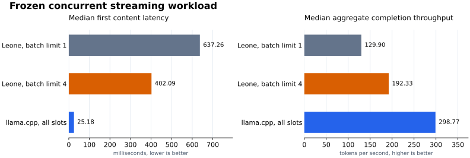

# Leone

Leone is a research LLM inference engine for consumer GPUs. It uses a Rust
runtime and handwritten CUDA kernels. The measured target is an NVIDIA RTX
4090.

The server batches active decode rows into shared matrix operations. Each
request keeps separate attention, sampling, cancellation, and session state.
Prefill yields between chunks so other admitted requests can continue decode.
KV admission uses fixed token pages and returns typed overload errors before
the configured capacity is exceeded.

## What ships

- Dense Qwen3 and Llama 3 text inference from GGUF.
- `Q4_K` and `Q6_K` weights on the CPU and CUDA backends.
- `f32`, `f16`, and `q8` KV cache storage.
- Chunked prefill. Graph-replayed CUDA decode on models that support it.
- Continuous decode batching across active requests.
- Resumable prefill with cancellation at chunk boundaries.
- Physical allocation counters for session buffers and backend scratch.
- Greedy and stochastic sampling with an FP64 CPU oracle.
- Exact speculative verification and adaptive proposal controllers.
- Persistent, hibernated, and forked generation sessions.
- Bounded scheduling with page-rounded KV admission and typed backpressure.
- A documented OpenAI chat subset with streaming and tool calls.
- Signed response receipts.

Each kernel has a scalar reference path. See [the oracle contract](docs/oracle.md)
and [the speculation contract](docs/speculation.md).

## Scope

| Area | Support |
|---|---|
| Measured GPU | NVIDIA SM89 |
| Correctness target | SM89 and SM120 |
| Model families | Dense Qwen3 and Llama 3 |
| Weight formats | `Q4_K`, `Q6_K` |
| Workload | Concurrent text requests, batch-1 per request |
| Server | Local HTTP, documented OpenAI chat subset |
| Other GPU vendors | Not implemented |
| Vision and MoE | Metadata probe only |

Before inference, run `leone doctor -m model.gguf`. The command reports the
architecture, tensor formats, backend support, and model limits without loading
all weights.

## Install

Binary packages support Linux x86_64. They require a supported NVIDIA GPU,
CUDA, and cuBLAS. Windows and macOS packages are not available.

Install an extracted binary archive with:

```sh
./install.sh
```

The OpenAI Python client can use the HTTP endpoint. Leone has no Python runtime
API. Crates are not published as part of the binary release.

## Build

Rust 1.92, CUDA, cuBLAS, and a supported NVIDIA GPU are required.

```sh
cargo +1.92 build --release -p leone-cli
./target/release/leone doctor -m model.gguf
```

The local release gate runs on SM89, an RTX 4090. SM120 is a correctness and
non-regression target. It is not validated locally.

## Generate text

```sh
./target/release/leone generate \
  -m model.gguf \
  -p 'State one invariant of exact speculative decoding.' \
  -n 64
```

Use `--backend cpu` for the scalar runtime. Use `--kv q8` to reduce KV storage.
Run `leone generate --help` for all controls.

## Serve chat completions

```sh
./target/release/leone serve \
  -m model.gguf \
  --bind 127.0.0.1:8080 \
  --sessions 8 \
  --batch-size 8 \
  --session-store .leone-sessions
```

```sh
curl http://127.0.0.1:8080/v1/chat/completions \
  -H 'content-type: application/json' \
  -d '{"model":"leone","messages":[{"role":"user","content":"Define KV reuse."}]}'
```

The server binds to loopback by default. A non-loopback address requires
`--allow-remote`. The server does not provide authentication or TLS.

`--batch-size` limits the requests selected for one decode pass. `--sessions`
limits resident KV state. Explicit draft settings run outside the shared batch
path. Adaptive speculation is opt-in.

See [the OpenAI API subset](docs/openai-api.md) and
[the Python client check](docs/client-workflow.md).

## Evidence



The [streaming comparison](docs/concurrent-service-evidence.md) reports latency,
throughput, resident progress, physical memory, and common-oracle quality.

Correctness gates compare CUDA results with independent CPU oracles. The
batched-service study compares shared decode with the same concurrent workload
at a batch limit of one.

```sh
taskset -c 16-31 cargo +1.92 test --workspace
taskset -c 16-31 cargo +1.92 test --release -- --ignored --test-threads=1
```

Timing studies use physical performance cores and an otherwise idle GPU:

```sh
taskset -c 0-3,12-15 scripts/study-batched-service.sh \
  model.gguf plans/qwen3-8b-sm89.json quality.json study.json
```

The generated [release evidence](docs/release-evidence.md) states the tested
model, workload, results, and limits.

## Limits

- CUDA is the only accelerated backend.
- Each request has one sequence row. The server batches rows across requests.
- KV pages are admission units. Live sessions still own contiguous KV buffers.
- Prefill performance has no separate release threshold.
- The OpenAI API is a documented subset, not a drop-in implementation.
- Receipt self-verification proves the claim and signature agree. Signer
  identity requires a trusted public key distributed separately.
- Receipt schemas and the documented server subset have compatibility
  guarantees. Other public interfaces can change.

## Release gate

[The release gate](docs/release.md) defines the publication checks. A failed
gate delays the release.

## License

The project is dual-licensed under Apache-2.0 and MIT.
