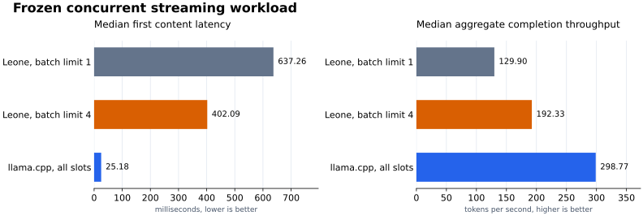

# Leone

Leone is a research LLM inference engine for consumer GPUs. It uses a Rust
runtime with handwritten CUDA and Metal kernels. The measured NVIDIA target
is an RTX 4090.

The CUDA server batches active decode rows into shared matrix operations. Each
request keeps separate attention, sampling, cancellation, and session state.
Prefill yields between chunks so other admitted requests can continue decode.
Sessions share immutable KV prefixes and append to private storage. KV admission
uses page-rounded reservations and returns typed overload errors at the
configured capacity.

## What ships

- Dense Qwen3 and Llama 3 text inference from GGUF.
- `Q4_K` and `Q6_K` weights on the CPU, CUDA, and Metal backends.
- `f32`, `f16`, and `q8` KV cache storage on CPU and CUDA. Metal uses `f16`.
- Chunked prefill. Graph-replayed CUDA decode on models that support it.
- Continuous CUDA decode batching across active requests.
- Resumable prefill with cancellation at chunk boundaries.
- Physical allocation counters for session buffers and backend scratch.
- Greedy and stochastic sampling with an FP64 CPU oracle.
- Exact speculative verification and adaptive proposal controllers.
- Persistent, hibernated, and forked generation sessions.
- Bounded scheduling with page-rounded KV admission and typed backpressure.
- A documented OpenAI chat subset with streaming and tool calls.
- Signed response receipts.

Each kernel has a scalar reference path. See [the oracle contract](docs/oracle.md)
and [the speculation contract](docs/speculation.md).

## Scope

| Area | Support |
|---|---|
| Measured GPU | NVIDIA SM89 |
| Correctness target | SM89 and SM120 |
| Apple silicon backend | Metal chunked prefill and eager decode |
| Model families | Dense Qwen3 and Llama 3 |
| Weight formats | `Q4_K`, `Q6_K` |
| Workload | Concurrent text requests, batch-1 per request |
| Server | Local HTTP, documented OpenAI chat subset |
| AMD and Vulkan backends | Not implemented |
| Vision and MoE | Metadata probe only |

Before inference, run `leone doctor -m model.gguf`. The command reports the
architecture, context limit, and backend support without loading all weights.

## Install

Binary packages support Linux x86_64 with CUDA and Apple silicon macOS with
Metal. Windows and Intel macOS packages are not available.

Install an extracted binary archive with:

```sh
./install.sh
```

The OpenAI Python client can use the HTTP endpoint. Leone has no Python runtime
API. Crates are not published as part of the binary release.

## Get a model

The built-in registry provides verified model downloads. List the entries, then
pull one by ID or alias:

```sh
leone models
leone pull qwen3:8b
```

Start interactive chat from the verified cache:

```sh
leone run qwen3:8b --tokens 64
```

See [model workflows](docs/models.md) for custom registries and cache paths.

## Build

All builds require Rust 1.92. The default Linux build requires CUDA and cuBLAS.
Inference with that backend requires a supported NVIDIA GPU.

```sh
cargo +1.92 build --release -p leone-cli
./target/release/leone doctor -m model.gguf
```

For Apple silicon, install the Metal compiler (`xcrun metal`) and build with:

```sh
cargo +1.92 build --release -p leone-cli --no-default-features --features metal
./target/release/leone doctor --backend metal -m model.gguf
```

For a CPU-only build, use `--no-default-features` without `--features metal`.

The local release gate runs on SM89, an RTX 4090. SM120 is a correctness and
non-regression target. It is not validated locally.

## Generate text

```sh
./target/release/leone generate \
  -m model.gguf \
  -p 'State one invariant of exact speculative decoding.' \
  -n 64
```

Use `--backend cpu` for the scalar runtime. On CPU and CUDA, `--kv q8` reduces
KV storage. On Apple silicon, use `--backend metal --kv f16`.
Run `leone generate --help` for all controls.

## Serve chat completions

```sh
./target/release/leone serve \
  -m model.gguf \
  --bind 127.0.0.1:8080 \
  --sessions 8 \
  --batch-size 8 \
  --session-store .leone-sessions
```

```sh
curl http://127.0.0.1:8080/v1/chat/completions \
  -H 'content-type: application/json' \
  -d '{"model":"leone","messages":[{"role":"user","content":"Define KV reuse."}]}'
```

The server binds to loopback by default. A non-loopback address requires
`--allow-remote`. The server does not provide authentication or TLS.

`--batch-size` limits the requests selected for one decode pass. `--sessions`
separately limits admitted requests and resident idle sessions. Memory budgets
cap their combined allocations. Explicit draft settings run outside the shared
batch path. Adaptive speculation is opt-in for `serve`.

See [the OpenAI API subset](docs/openai-api.md) and
[the Python client check](docs/client-workflow.md).

Use the [OpenAI Python SDK](https://pypi.org/project/openai/) with the local
server:

```sh
python3 -m pip install openai==3.16.2
python3 - <<'PY'
from openai import OpenAI

client = OpenAI(base_url="http://127.0.0.1:8080/v1", api_key="local")
response = client.chat.completions.create(
    model="leone",
    messages=[{"role": "user", "content": "Define KV reuse."}],
)
print(response.choices[0].message.content)
PY
```

## Validation and research evidence

Native CUDA and Metal builds have focused kernel, session, and client checks.
Performance results apply to the workload, device, and build named in each
receipt. The optional studies below describe the builds they record.

### Optional research evidence



The [streaming comparison](docs/concurrent-service-evidence.md) reports latency,
throughput, resident progress, physical memory, and common-oracle quality.

CUDA correctness gates compare quantized results with independent CPU oracles.
Metal quantized tests use the same scalar contract on Apple silicon. The staged
Metal quality workflow in [the oracle contract](docs/oracle.md) compares native
Metal logits with pinned CPU and llama.cpp subjects. The release manifest declares
records for both backends. A Metal quality claim requires the staged workflow and
its archive checks.

```sh
taskset -c 16-31 cargo +1.92 test --workspace
taskset -c 16-31 cargo +1.92 test --release -- --ignored --test-threads=1
```

On Apple silicon, build the Metal binary and run its backend and model lifecycle
checks:

```sh
cargo +1.92 build --release -p leone-cli --no-default-features --features metal
cargo +1.92 test --release -p leone-metal
LEONE_METAL_MODEL=models/Qwen3-8B-Q4_K_M.gguf \
  cargo +1.92 test --release -p leone-metal --test lifecycle qwen_metal_session_lifecycle -- --ignored --test-threads=1
LEONE_METAL_MODEL=models/Llama-3.2-1B-Instruct-Q4_K_M.gguf \
  cargo +1.92 test --release -p leone-metal --test lifecycle llama_metal_session_lifecycle -- --ignored --test-threads=1
```

The standard source checks do not execute these Apple GPU checks. Follow the
staged quality workflow in [the oracle contract](docs/oracle.md) before making a
Metal quality claim.

Timing studies use physical performance cores and an otherwise idle GPU. The
study script exits with status 2 when tracked files have uncommitted changes or
an input path is absolute. Input paths are relative to the repository root. It
also exits with status 2, before any measurement, when the output path exists.
A symlink or a directory counts as existing. The script creates the receipt only
after every repetition finishes. After a failure it keeps the completed run
records, raw responses, and server logs in `OUTPUT.runs.*`. A throughput or
latency loss does not stop the repetitions. The receipt stays at its path, and
the script exits with status 1.

The study runs `LEONE_BINARY` (default `target/release/leone`). It exits with
status 2, before any server starts, unless `--build-info` reports a clean
release CUDA build whose source inputs equal the current tree. It also exits
with status 2 if a port it uses already has a listener, and with status 1 if a
study server exits before its measurements end. Set
`LEONE_STUDY_SOURCE_MANIFEST` to a repository-relative source manifest recorded
before the study to check against it. The receipt records the binary SHA-256, its build
information, the GPU name, driver version, memory, and compute capability, the
prompt SHA-256, the batch limit passed to each server, and the five run records.
Dispatch widths are unmeasured. Run records keep response digests, not signed
responses:

```sh
study="receipts/$(date -u +%Y-%m-%dT%H-%M-%SZ)-batched-service-study.json"
taskset -c 0-3,12-15 scripts/study-batched-service.sh \
  models/Qwen3-8B-Q4_K_M.gguf \
  plans/qwen3-8b-sm89.json \
  "$(jq -r '.executions.leone_q4.quality.receipt' receipts/quality-concurrent-service.json)" \
  "$study"
scripts/render-release-evidence.sh docs/release-evidence.md "$study"
```

The renderer takes the study receipt as its optional second argument. Before it
replaces the output, it rejects a receipt that fails the gate or does not record
the Qwen3 8B model, four clients, and an RTX 4090. Only the historical default
receipt may omit the GPU record. The generated
[release evidence](docs/release-evidence.md) links the chosen receipt and states
the tested model, workload, results, and limits.

## Limits

- Metal requires Apple silicon and uses eager decode without CUDA graph replay.
- Each request has one sequence row. The server batches rows across requests.
- KV pages are admission units. Physical KV storage consists of shared prefixes
  and private segments.
- Prefill and decode results apply to the workloads recorded in their receipts.
- The OpenAI API is a documented subset, not a drop-in implementation.
- Receipt self-verification proves the claim and signature agree. Signer
  identity requires a trusted public key distributed separately.
- The session store does not reclaim unreferenced checkpoint blobs or
  crash-left temporary files. Its disk use can grow. Follow the
  [session store disk recovery procedure](docs/openai-api.md#session-store-disk-recovery)
  before replacing a store.
- Receipt schemas and the documented server subset have compatibility
  guarantees. Other public interfaces can change.

## Release checks

[The release checks](docs/release.md) cover runtime packages and optional
research workflows.

## License

The project is dual-licensed under Apache-2.0 and MIT.
